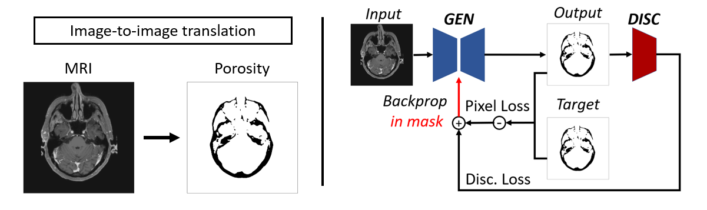

# mri-to-ct



## Introduction

This repo contains the code from paper XXX. This guide is here to help you run the code on your device, and train a MRI-to-CT translation model. If you intend to use this program for your research, use the citation below:

    @article{}

## Dependencies

Create a new Python environment. To retrieve packages, run:

    pip install -r requirements.txt

## Download

    git clone https://github.com/MatDagommer/mri-to-ct.git

## Create a dataset

This program requires the following 3D volumes for each subject: CT, pseudo-CT, MRI, and skull mask.
CT and MRI are raw volumes that can be retrieved with your own acquisition routine.
Pseudo-CT can be obtained using SPM8-method [1].
The skull mask should be obtained with Freesurfer's segmentation tool SAMSEG [2].

In the folder ``` /data/raw_data ```, create a folder for each subject containing 4 NIfTI files:

* ``` CTlnT1_resliced.nii ``` (CT)
* ``` pCTlnT1_resliced.nii ``` (pseudo-CT)
* ``` skull_SAMSEG_resliced.nii ``` (Skull Mask)
* ``` T1_resliced.nii ``` (T1-MRI)

## Preprocessing

To start default preprocessing of the data, run:

    python preprocessing.py --dataset <nameOfDataset>

You can customize data preprocessing. For more information on the different options, run:

    python preprocessing.py --help
    
The resulting preprocessed data is stored in ``` /data/datasets/<nameOfDataset> ```.

## Training

Run the following line to train the default model:

    python train.py --dataset <nameOfDataset> --name <nameOfModel>

## Retrieve results

In the folder ```/notebooks```, you will find result acquisition notebooks from the paper. You can use them as examples to load and plot your own results.

## References

[1] Izquierdo-Garcia, D., Hansen, A. E., Förster, S., Benoit, D., Schachoff, S., Fürst, S., ... & Catana, C. (2014). An SPM8-based approach for attenuation correction combining segmentation and nonrigid template formation: application to simultaneous PET/MR brain imaging. Journal of Nuclear Medicine, 55(11), 1825-1830.

[2] Puonti, O., Iglesias, J. E., & Van Leemput, K. (2016). Fast and sequence-adaptive whole-brain segmentation using parametric Bayesian modeling. NeuroImage, 143, 235-249.
